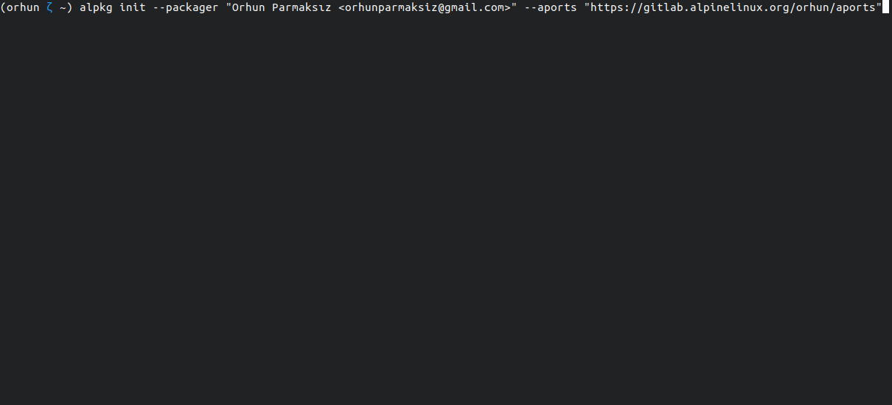

# `alpkg` 🏔

[](https://github.com/orhun/alpkg/actions)

**Set up Alpine Linux packaging environment with a breeze!**


`alpkg` is a tool for _all_ your Alpine packaging needs. It can create a chroot with preinstalled tools in a matter of seconds, set up [aports repository](https://gitlab.alpinelinux.org/alpine/aports), and fetch/update packages. Most importantly, it provides a split layout via [Zellij](https://github.com/zellij-org/zellij) for easy editing/building [`APKBUILD`](https://wiki.alpinelinux.org/wiki/APKBUILD_Reference) files.

## Requirements

- [alpine-chroot-install](https://github.com/alpinelinux/alpine-chroot-install)
  - See [requirements](https://github.com/alpinelinux/alpine-chroot-install#requirements).

## Usage

```
Usage: alpkg [init|edit|fetch|update] [<package>]

Commands:
  init              Initialize an Alpine chroot.
  edit <package>    Edit or create a package.
  fetch <package>   Fetch an existing package from the remote repository.
  update <package>  Update the package on the remote repository.
  destroy           Remove the chroot and repository.

Options:
  --packager "Your Name <your@email.address>"              The name and email address of the package maintainer.
  --aports "https://gitlab.alpinelinux.org/<user>/aports"  The URL of the remote APorts repository.
```

## Features

### `init`

To create an Alpine Linux chroot and initialize [aports repository](https://gitlab.alpinelinux.org/alpine/aports) for packaging, simply run:

```sh
alpkg init --packager "Your Name <your@email.address>" --aports "https://gitlab.alpinelinux.org/<user>/aports"
```

It is possible to pass options to `alpine-chroot-install` via environment variables.

<details>
<summary><b>Demo</b></summary>



</details><br>

\* You need to create an account on [https://gitlab.alpinelinux.org](https://gitlab.alpinelinux.org) and fork the [aports repository](https://gitlab.alpinelinux.org/alpine/aports) under your user.

\* If you run `alpkg init` in your `$HOME` directory, Alpine working directory will point to `$HOME/apkbuilds`.

### `edit`

To create a new `APKBUILD`, you can use the `edit` command. Note that it uses [`newapkbuild`](https://wiki.alpinelinux.org/wiki/Include:Newapkbuild) under the hood so you can pass `newapkbuild` options to it:

```sh
alpkg edit <newapkbuild_opts> <package_name>
```

For example:

```sh
alpkg edit -r -d "A highly customizable changelog generator" -l "GPL-3.0-only" -u "https://github.com/orhun/git-cliff" git-cliff
```

Or you can generate an empty package with the following command:

```sh
alpkg edit testpkg
```

<details>
<summary><b>Demo</b></summary>


</details><br>

If the package _already exists_, you can also use `edit` command to edit the contents of the `APKBUILD`.

<details>
<summary><b>Demo</b></summary>


</details>

### `fetch`

To fetch existing packages from `aports` and edit them:

```sh
alpkg fetch <package_name>
```

<details>
<summary><b>Demo</b></summary>


</details>

### `update`

To commit the changes to the `aports` repository:

```sh
alpkg update <package_name>
```

<details>
<summary><b>Demo</b></summary>


</details>

## License

This project is licensed under [The MIT License](./LICENSE).

## Copyright

Copyright © 2023, [Orhun Parmaksız](mailto:orhunparmaksiz@gmail.com)
